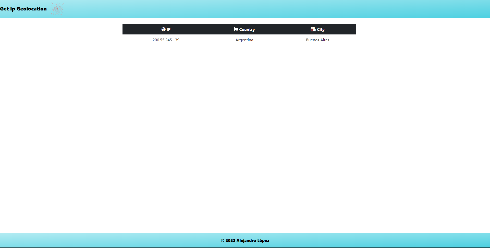

# <h1 align="center" style="color: #80cbc4;"> Get Ip Geolocation 👨🏻‍💻 </h1> 
  

`IP Geolocation` and reverse IP geocoding technology on the web are about detecting requests coming from your visitors and locating them in the world, down to the city they are in, based on their IP address.

`geoPlugin` is the easiest way for you to geolocate your visitors, allowing you to provide geolocalised content more relevant to their geographical location. Simple examples are redirecting visitors to language-specific pages, providing your product prices in your visitor's local currency, knowing whether European GDPR privacy rules apply, and much more.     
  

## 
 Requirements 

- [HTML5](https://developer.mozilla.org/es/docs/Web/HTML) 
- [JavaScript](https://developer.mozilla.org/es/docs/Web/JavaScript)

## 
 References 

- [geoPlugin](https://www.geoplugin.com/)
 

  

## 
 Screenshot Project 💻 

🔶 [Project Website](https://alejandro-190107.github.io/Get-Ip-Geolocation/)

